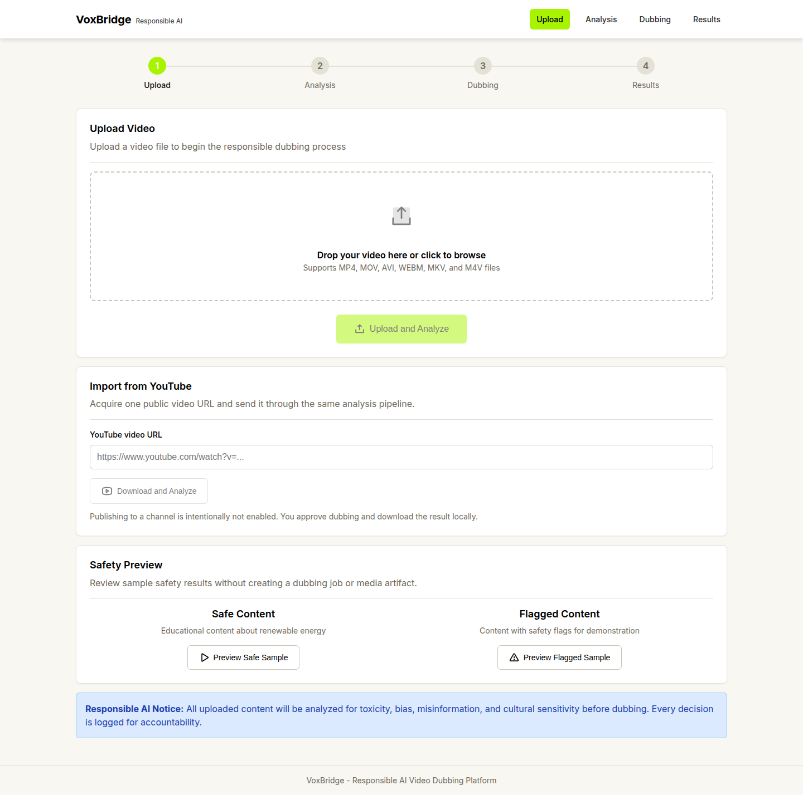
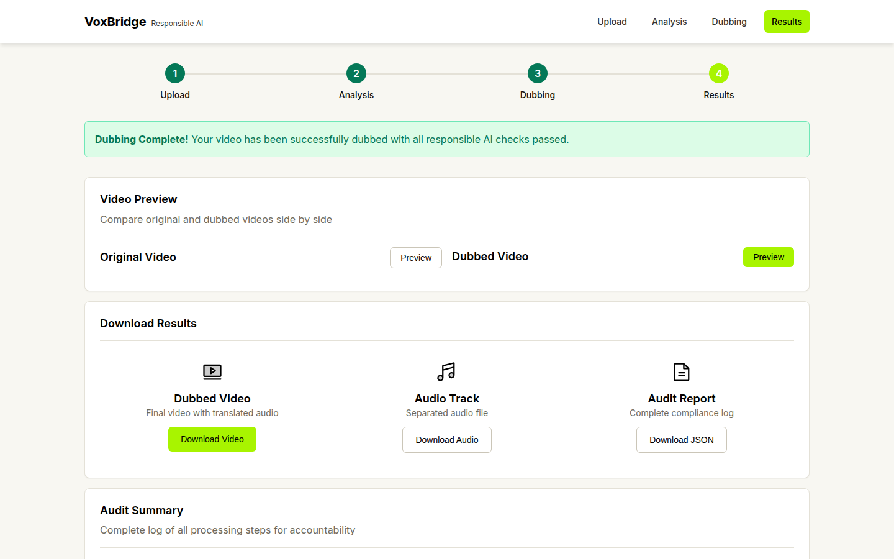

# VoxBridge

Responsible multilingual video dubbing for creators, with safety checks,
consent controls, and an auditable workflow.



---

## What It Does

VoxBridge turns an uploaded video or public YouTube URL into a translated,
dubbed video without treating AI localization as a black box.

Before voice synthesis, it transcribes the source, checks the transcript for
toxicity, bias, misinformation risk, and cultural-sensitivity concerns, and
requires explicit user approval. The final result includes the dubbed video,
its audio track, and a downloadable audit report.

---

## The Workflow

1. Upload a local video or acquire one public YouTube video.
2. Extract and transcribe speech with timestamps.
3. Review safety findings and their evidence.
4. Choose a target language and confirm voice-synthesis consent.
5. Translate and generate real speech with the configured TTS provider.
6. Synchronize the new speech with the source video using FFmpeg.
7. Download the dubbed video, audio track, and audit report.

## Completed Result



---

## Core Capabilities

- Pre-dubbing content moderation
- Bias, toxicity, and misinformation detection
- Translation transparency with confidence scores
- Ethical voice synthesis with consent enforcement
- End-to-end audit logging
- YouTube URL acquisition alongside local file upload
- Local SQLite mode for reproducible demo recording
- Provider-selectable TTS through Gemini, OpenAI, or ElevenLabs
- Timestamp-aware audio placement with output duration validation

---

## Architecture Summary

```
React Frontend
       |
       v
FastAPI Gateway
       |
       v
Service Layer
  - Media Processing
  - Safety Analysis (Core)
  - Translation
  - Voice Synthesis
  - Audit Logging
       |
       v
Final Dubbed Video + Compliance Logs
```

---

## Technology Stack

| Layer | Tech |
|------|-----|
| Frontend | React + Vite |
| Backend | FastAPI (Python 3.11) |
| AI | Gemini API |
| TTS | Gemini, OpenAI, or ElevenLabs |
| Media | ffmpeg, MoviePy |
| Database | SQLite locally, PostgreSQL for deployment |
| Package Mgmt | uv |

---

## Responsible AI Focus

This is **not** a dubbing tool with safety added later.  
Safety is the **first-class feature**.

Every AI decision:
- Is explainable
- Is logged
- Can be audited
- Can be overridden only with acknowledgment

VoxBridge does not silently fall back to fabricated speech when a provider
fails. Real mode reports provider, credential, quota, and media-processing
errors directly to the user.

---

## Quick Start

### Backend

```bash
cd backend
uv sync
cp .env.example .env
# Add Gemini credentials, then keep:
# DEMO_MODE=false
# TTS_PROVIDER=gemini
uv run uvicorn app.main:app --reload
```

### Frontend

```bash
cd frontend
npm install
npm run dev
```

### Access Points

- Frontend: http://localhost:5173
- Backend API: http://localhost:8000
- API Docs: http://localhost:8000/docs

---

## Provider Modes

- `gemini`: current verified local provider for analysis, translation, and TTS.
- `openai`: OpenAI speech generation using `OPENAI_API_KEY`.
- `elevenlabs`: ElevenLabs multilingual speech using `ELEVENLABS_API_KEY`.
- `fixture`: clearly labeled local tone output, available only with `DEMO_MODE=true`.

## Honest Demo Boundary

The frontend's safe and flagged samples are safety previews only; they do not
create fake jobs or downloadable artifacts. For a complete local artifact
demo, run the backend with the explicit fixture provider and upload a real
video:

```bash
cd backend
DEMO_MODE=true TTS_PROVIDER=fixture uv run uvicorn app.main:app --host 127.0.0.1 --port 8000
```

This still exercises YouTube/file acquisition, SQLite persistence, FFmpeg
extraction/mixing/merge, consent, and audit/download endpoints. The transcript,
translation, and tone audio are labeled fixtures rather than external-provider
output.

Real mode uses Gemini plus the selected Gemini, OpenAI, or ElevenLabs TTS
provider. Provider failures are surfaced as job errors; no fabricated voice
fallback is used.

Judges are encouraged to review audit logs.

---

## API Reference

| Endpoint | Method | Description |
|----------|--------|-------------|
| `/api/upload-video` | POST | Upload video file (MP4, MOV, AVI, MKV, WEBM) |
| `/api/import-youtube` | POST | Acquire one public YouTube video URL |
| `/api/analyze-content` | POST | Run safety checks, returns risk report |
| `/api/approve-and-dub` | POST | Proceed with dubbing after approval |
| `/api/audit-report/{job_id}` | GET | Retrieve audit logs and compliance data |
| `/api/job-status/{job_id}` | GET | Check current job status |
| `/api/download/{type}/{job_id}` | GET | Download video, audio, or audit file |

---

## Documentation

- `ARCHITECTURE.md` — system design details

---

## License

MIT License
